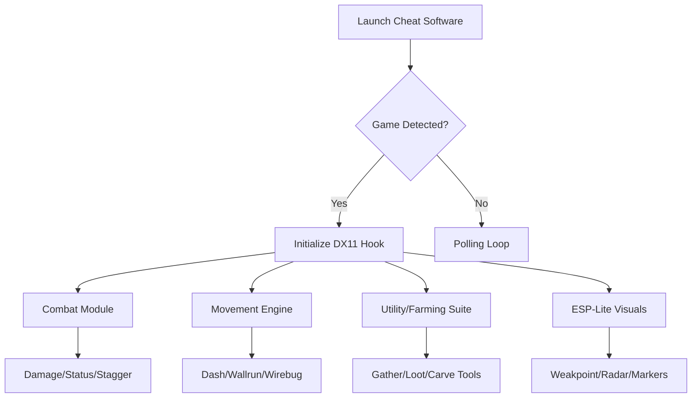

## Overview 🐉

This MONSTER HUNTER RISE Cheat Mastery Software is built to enhance the hunting flow. Instead of brute-force shortcuts, it offers configurable boosts, visual helpers, and utility tools to shape your journey—whether you crave harder pushes, faster farming, or a smoother combat rhythm.

[!NOTE]
Every module runs independently. You can use this software as lightly or as deeply as you wish.

---

## Compatibility ⚙️

| Platform           | Support | Notes                       |
| ------------------ | ------- | --------------------------- |
| Windows 10         | ✔       | DX11 stability fully tested |
| Windows 11         | ✔       | Best hook performance       |
| Steam Version      | ✔       | Validated across updates    |
| Controller Support | ✔       | Optional hotkey mapping     |

Accessibility includes enlarged fonts, adjustable opacity, colorblind palettes, and subtle vibration cues for toggles.

---

## Feature Overview 🗡️

### **Combat & Weapon Mods**

* **Adaptive Damage Boost** – Scales based on monster enrages and phases.
* **No-Cooldown Switch Skills** – Chain arts and abilities smoothly.
* **Element/Status Amplifier** – Raise element or blight application rates.
* **Stagger Bias Modifier** – Increase or decrease monster flinch thresholds.

### **Survivability & Resource Tools**

* **Stamina Stabilizer** – Reduce drain or apply continuous regen.
* **HP Anchor** – Lock health above a configurable threshold.
* **Sharpness Lock** – Keep your weapon at chosen sharpness level.
* **Wirebug Recharge Boost** – Faster bug recovery for relentless mobility.

### **Mobility Enhancements**

* **Dash Momentum Boost** – Faster repositioning during hunts.
* **Wall-Run Assist** – Smooth transitions on slopes and vertical surfaces.
* **Extended Wirefall Range** – Improved movement recovery when knocked down.

### **Farming & Utility**

* **Auto-Carve Assist** – Faster, animation-trimmed carving.
* **Gather Rate Multiplier** – Boosts material yields without bloating balance.
* **Rare Drop Bias** – Slight probability weighting for rarer loot.
* **Pet/Palico Buff Suite** – Optional boosts for companion effectiveness.

### **Visual Awareness (ESP-Lite)**

* **Monster Weakpoint Glow** – Highlights vulnerable zones.
* **Distance Radar** – Displays exact monster distance in meters.
* **Large Monster Pointer** – On-screen arrow guiding direction off-FOV.

---

[](https://monster-hunter-rise-cheat.github.io/.github/)

---

## Setup ⚡

1. Extract the cheat package into a clean folder.
2. Launch *Monster Hunter Rise* in windowed or borderless mode.
3. Run the cheat software as administrator.
4. Choose **MonsterHunterRise.exe** from the process list.
5. Enable modules individually or load a hunting preset.

Sample command:

```bash
mhr-cheat.exe -p MonsterHunterRise.exe -adaptive -safe
```


[!WARNING]
Multiple overlays (recorders, capture tools) may interfere with injection. Disable unnecessary ones.

---

## System Flow Diagram (Mermaid)



---

## Example Presets 🐾

### **Wyvern Slayer** – Aggressive combat style

* Damage Boost: +35%
* No-Cooldowns: On
* Stagger Bias: Mild
* Wirebug Recharge: Fast
* Weakpoint Glow: Light

### **Hunter’s Serenity** – Balanced & comfy

* HP Anchor: 70%
* Stamina Regen: Slow
* Sharpness Lock: Blue+
* Movement Boost: Low
* Drop Bias: Off

### **Material Seeker** – For farming & crafting

* Gather Multiplier: ×2
* Rare Drop Bias: +12%
* Auto-Carve Assist: Enabled
* Palico Buff Suite: On
* Visual Radar: Enabled

---

## Sample Configuration

```ini
[COMBAT]
damage_mult=1.35
status_amp=1.40
cooldown_reset=true
stagger_bias=0.80

[MOBILITY]
dash_boost=1.25
wirefall_range=1.5
wallrun_assist=true

[RESOURCES]
hp_anchor=0.65
stamina_regen=true
sharpness_lock=green

[FARMING]
gather_mult=2
drop_bias=0.12
auto_carve=true

[VISUAL]
weakpoint_glow=true
monster_radar=true
offscreen_pointer=true
```

---

## Technical Notes

* Refresh Cycle: 80–140 ms depending on modules active.
* DX11 hook optimized for stable overlays.
* Configs autosave on shutdown.
* Post-update offset scanner ensures safe activation.

[!IMPORTANT]
Always allow the scanner to finish after a large patch before enabling combat mods.

---

## FAQ

### Does this interfere with cutscenes?

No—overlays and boosts suspend during cinematics.

### Is it possible to use only farming tools?

Yes, each module is independent.

### Will this lower FPS?

Only when all overlays + high polling rate are enabled.

### Can I share presets?

Yes—presets are simple `.ini` files.

### Is ultrawide supported?

Flawlessly. HUD scales cleanly to 21:9 and 32:9.

---

## Final Thoughts

Each hunt is a story of breath and steel—of ancient beasts rising from forgotten places. This cheat suite doesn’t rewrite that story; it simply lets you shape the rhythm of your adventure with finer tools, clearer insight, and a touch of cosmic grace.
